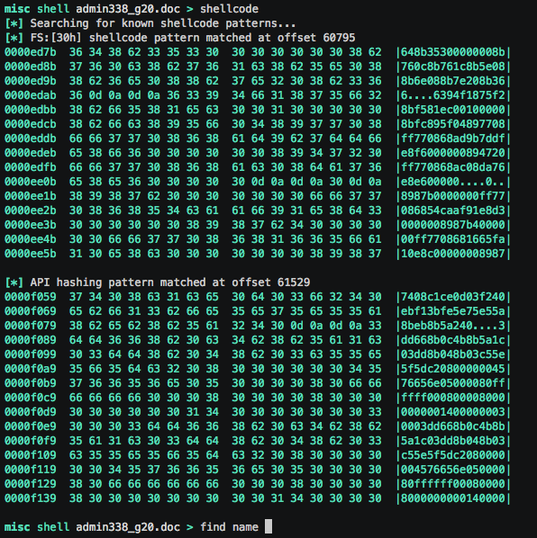
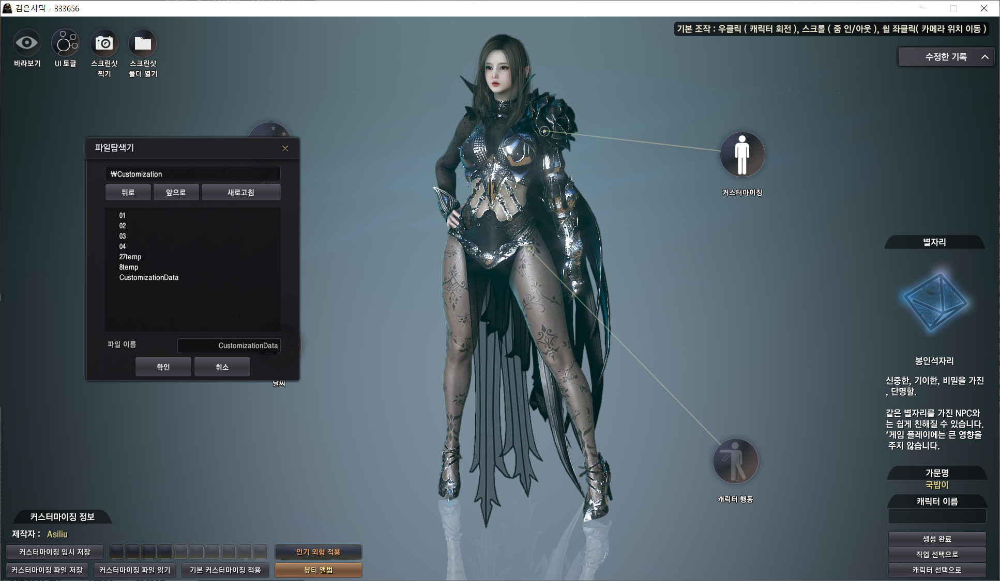
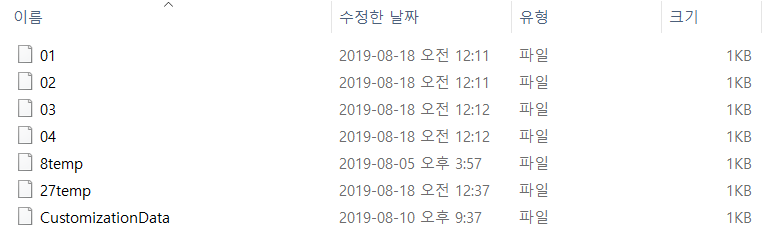
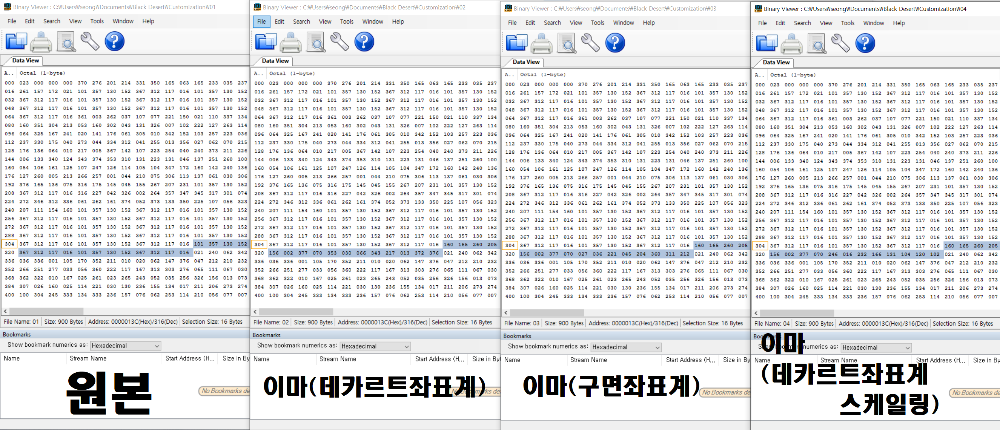
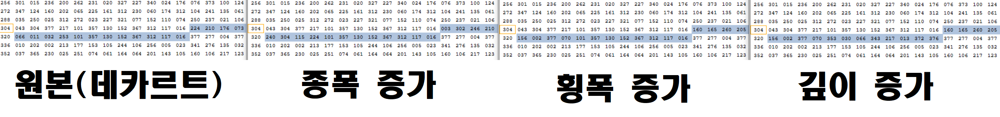

# Binary Analysis  

Binary analysis analyzes the raw binaries that compose a complete application, which is especially helpful when there isn’t access to the source code. Since Bluehole Company doesn't provide how to decode customization files, we have to find out meaning of the 900 bytes customization file.  

## #1. Just find differences while changing the character's customization parameter

This is the screenshot when you start BDO. You can control parameters and save customization file by just one click.  

The customization files are saved into specific folder like this but with no format, just name. I can accidentally find type of the files using file opener. It's **Binary File**! However, you have to know encoding type such as UTF-8, UTF-16,ASCII, .... and you don't have any hint for that. So, let's find out structure of this binaries.

 

Once you open files with binary opener, you can see this listed numbers. I can find the differences by changing just one part of face, forehead. From 316th byte to 331th byte changed from forehead parameters control.  

Interestingly, BDO has 3 parameter controller.  

* Cartesian coordinate system
* Spherical coordinate system
* Scaling the size of features

So I control parameters only using Cartesian controller.

* Width Increase : 316th ~ 323th bytes
* Height Increase : 316th ~ 323th bytes
* Depth Increase : 324th ~ 331th bytes

